# NUMBERS GAME

Want to play a game? Who doesn't!

Lucky for you, there is a new game in town and it's said to be very addictive.

Our game is called 'Numbers game'. 

The point of the game is to clear all of the numbers from the screen by following a few simple rules. 
Depending on the users current result, they can take advantage of several boosters.

Our target audience are any users with access to the Internet. And more specifically, users with thirst for quality content without adds. 
Our ideal user is a working professional who commutes to and from work and/or has too much time on their hands when on their lunch break. 
A user that wishes to have at least something under their control, their square of peace and quiet. 
Our user does not want a permanent commitment, but a temporary escape without repercussions.

Game's goal is for it's users to relax their mind all while practicing logical and strategic thinking.

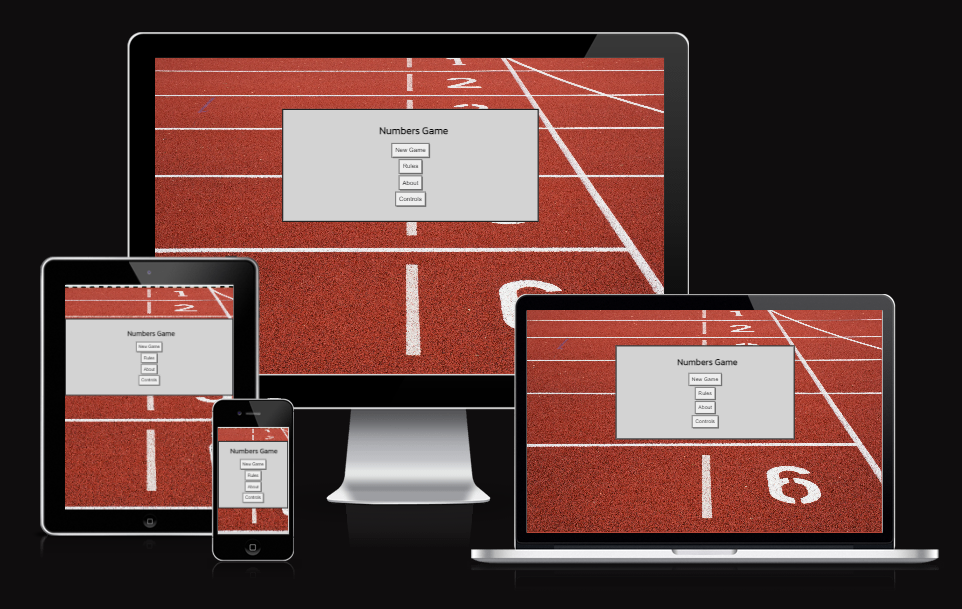

## UX

### Colour Scheme

Colour scheme was decided based on the background image.
The main goal was for image's content to be a connection between outdoor sports activity, all the while having an abstract connection to the game's content.

Once the image was sourced, the colour scheme of the game needed to provide direct contrast while being simple and easy on the eyes.

- `#BC4A3C` used for background colour in case image does not load.
- `#000001` user as primary border, text colour, icons as well as span colour upon successful removal of valid pairs in-game.
- `#D3D3D3` used as primary background colour of the game-area to provide initial contrast from the background image.
- `#F5F5F5` used as a secondary background colour of the areas containing text.
- `#E5E619` used as a tertiary background colour to highlight user's choice.
- `#808080` used as a secondary border colour.
- `#F4C430` used as a quaternary background colour to display hints.

I used [coolors.co](https://coolors.co/f4c430-e5e619-f5f5f5-d3d3d3-808080-000001-bc4a3c) to generate my colour palette:

### Typography

- [Kanit](https://fonts.google.com/specimen/Kanit) was used for the primary headers and titles.

- Courier New was used for all other secondary text.

- [Font Awesome](https://fontawesome.com) icons were used for sound toggling options.

## Wireframes

I've used [Balsamiq](https://balsamiq.com/wireframes) to design my site wireframes.

### Home Page Wireframes

| Size | Screenshot |
| --- | --- |
| Mobile |  |
| Desktop |  |

### Rules Wireframes

| Size | Screenshot |
| --- | --- |
| Mobile | 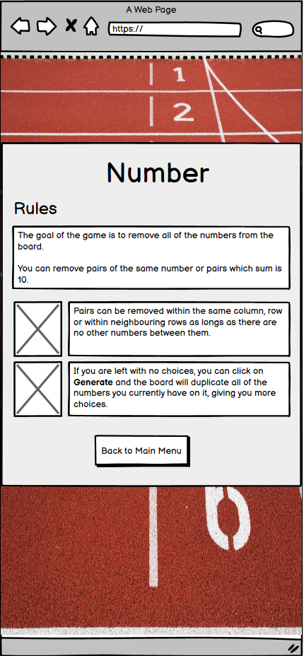 |
| Desktop |  |

### About Wireframes

| Size | Screenshot |
| --- | --- |
| Mobile |  |
| Desktop |  |

### Controls Wireframes

| Size | Screenshot |
| --- | --- |
| Mobile |  |
| Desktop |  |

### Difficulty Menu Wireframes

| Size | Screenshot |
| --- | --- |
| Mobile |  |
| Desktop |  |

### Game Wireframes

| Size | Screenshot |
| --- | --- |
| Mobile |  |
| Mobile |  |
| Desktop |  |
| Desktop |  |

- **Deviation from wireframes**

    - Button placement and content has been revised during production to optimise the experience and allow room for features which were not part of the MVP (hint, remove fifth). That being said, user can still easily access rules and controls when pausing the game.
    - Back to top button has not been implemented due to the fact that this feature was initially planned to allow the user to easily reach the game button section. This was resolved by ensuring the button section remains visible at all times. Taking into the account the usual logic of game solving, user will have no need to scroll all the way to the top since they are either solving the game from the top or the bottom - leaving gaps in between solved areas will prove unwise.

## Features

### Existing Features

- **Responsive design**

    - Our game is accessible via phones, tables and desktop devices.

- **Difficulty levels**

    - User can choose their difficulty level. Their choice will decide on the initial size of the game.

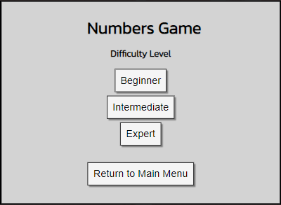

- **Generate button and functionality**

    - User can choose to generate all existing squares (spans) to allow for more options when solving the game.

- **Hint button and functionality**

    - If user is unsure of their next move, they can use the hint button to see available match. In case there are none, Generate button will be highlighted instead.

- **Undo button**

    - After a successful removal of a pair, user has an option to use the undo button should they notice their choice not being the best. Undo button will be disabled in several instances to prevent gaming and boost genuine experience.

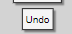

- **Remove fifth button and functionality**

    - User can choose to spend their points by using a 'remove fifth' booster. This button is enabled only if the user has a minimum of 50 points and if there are more than 4 squares on the board.

- **Sound and sound options**

    - User can choose to switch the sound on or off. When game is initially launched, sound will be switched off.

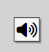

- **Return to Menu button**

    - Each section of the game enables user to return to the main menu.

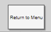

- **Pause game**

    - Should the user return to the menu during a live game session, the main menu will contain 'continue' and 'quit game' buttons.

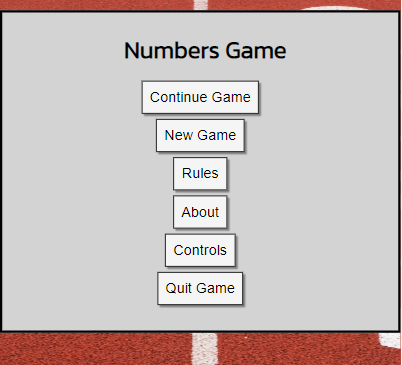

- **Continue game**

    - User can use continue button to return to the game. All stats, including the squares present on the board, sound preference and score will remain as they left them when pausing the game.

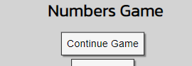

- **Quit game**

    - User can choose to quit the game. Pop-up will ask for confirmation. If the user decides to cancel the action, game will remain in it's paused state.

- **Stuck-check**

    - Should the user repeatedly use 'generate' button without any alternative actions, it is possible the player has no viable pairs to remove. For this reason, pop-up will appear notifying the player of the case. Game will be paused for player to decide on the next best action (continue game, or quit game)

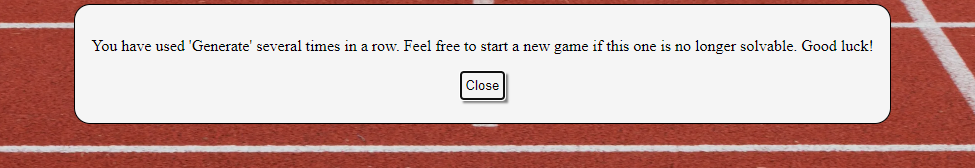

- **Row removal**

    - Once a full row has been emptied, it will be removed from the table to allow for better visibility. Image below is not representative of the actual action which takes place.

- **Score calculation**

    - Score is calculated, depending on the user's action. Removing a pair will add 2 points, removing a row will add additional 10 points. Using a hint, undo or remove fifth options will subtract specific amount of points from the overall score.

- **Choice validation**

    - User can make valid and invalid choices. Should a valid choice be made, the two squares will become dark. Otherwise the highlight showing the user's choice will be removed from the board. The same behaviour exists for instances when the user clicks the same square twice.

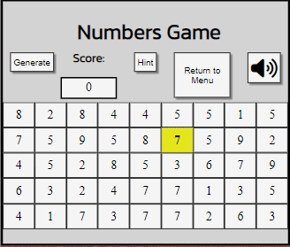

- **Game won confirmation**

    - Once all of the squares are removed from the board, a pop-up will automatically appear, notifying the user of their win. Pop-up will include their final score. User will be taken to the main menu.

- **Rules section**

    - Main menu includes a button which leads to the rules section. This section briefly explains the rules of the game.

- **About section**

    - Main menu includes a button which leads to the about section. This section briefly explains the inspiration for the game and contains a link taking the user to the creator's github page.

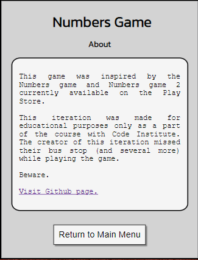

- **Controls section**

    - Main menu includes a button which leads to the controls section. This section briefly explains the controls used in-game. Depending on the screen size, user can see different options available.

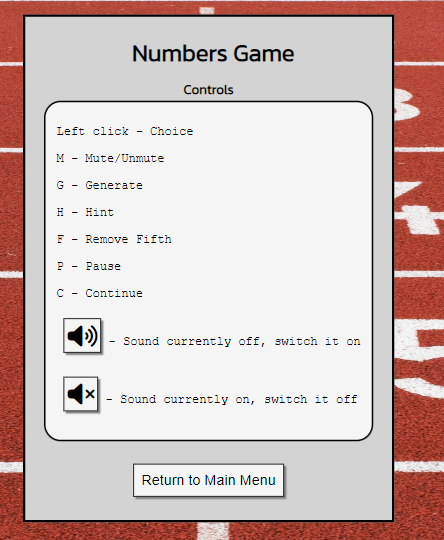
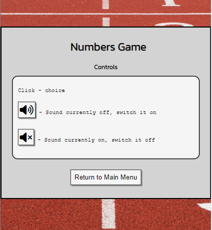

- **Shortcuts**

    - There are several shortcuts available in-game. User can un/mute the sound, pause the game, continue game, generate more squares, remove a fifth of them or ask for a hint. Depending on the availability of the boosters. To prevent unnecessary clicks, user can use majority of them to unpause the game all while their actual request is being acknowledged. This feature is intended to be used by desktop users and the controls section should not be displaying the shortcuts on devices smaller than the usual desktop width.

- **Re-playability**

    - When launching the game, the numbers will be randomly placed on the board, making the replayability value significant.

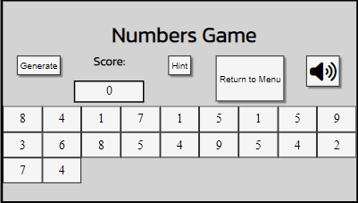

- **In-game button section**

    - Regardless of the screen size, in-game buttons will remain visible even if the board becomes sufficiently long to require scrolling. Name of the game is deprioritised in this case to maximise screen space.
    - Additional benefit here is the fact that the position of the buttons doesn't change regardless of button visibility. Should 'remove fifth' button not be available, it's space will remain blank instead of taken over by another button. This ensures familiarity for the user and removes room for accidents.

- **404 page**

    - 404 page exists to notify the user of a non-existent page. Page contains a link which allows user to transition to the main menu easily.

- **Favicon**

    - Favicon is available to allow for easier navigation between multiple tabs.

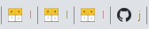

### Future Features

- Custom Modal box
    - In the future, we would like to replace pop-up windows with modal boxes.
- Randomise-booster
    - In the future, we would like to add additional booster which functions like a randomizer for the existing squares on the board.
- Leadership board
    - In the future, we would like to implement a scoreboard with users being able to add their usernames and compare their result to their peers depending on the level played.
- Light/dark theme
    - In the future, we would like to implement a variety of themes to make game more accessible all while allowing the user to choose the prefered theme.

## Tools & Technologies Used

- [HTML](https://en.wikipedia.org/wiki/HTML) used for the main site content.
- [CSS](https://en.wikipedia.org/wiki/CSS) used for the main site design and layout.
- [CSS Flexbox](https://www.w3schools.com/css/css3_flexbox.asp) used for an enhanced responsive layout.
- [CSS Grid](https://www.w3schools.com/css/css_grid.asp) used for an enhanced responsive layout.
- [JavaScript](https://www.javascript.com) used for user interaction on the site.
- [Git](https://git-scm.com) used for version control. (`git add`, `git commit`, `git push`)
- [GitHub](https://github.com) used for secure online code storage.
- [GitHub Pages](https://pages.github.com) used for hosting the deployed front-end site.
- [Gitpod](https://gitpod.io) used as a cloud-based IDE for development.
- [Codeanywhere](https://app.codeanywhere.com) used as a cloud-based IDE for development.

## Testing

For all testing, please refer to the [TESTING.md](TESTING.md) file.

## Deployment

The site was deployed to GitHub Pages. The steps to deploy are as follows:
- In the [GitHub repository](https://github.com/josipcodes/numbers-game), navigate to the Settings tab 
- From the source section drop-down menu, select the **Main** Branch, then click "Save".
- The page will be automatically refreshed with a detailed ribbon display to indicate the successful deployment.

The live link can be found [here](https://josipcodes.github.io/numbers-game)

### Local Deployment

This project can be cloned or forked in order to make a local copy on your own system.

#### Cloning

You can clone the repository by following these steps:

1. Go to the [GitHub repository](https://github.com/josipcodes/numbers-game) 
2. Locate the Code button above the list of files and click it 
3. Select if you prefer to clone using HTTPS, SSH, or GitHub CLI and click the copy button to copy the URL to your clipboard
4. Open Git Bash or Terminal
5. Change the current working directory to the one where you want the cloned directory
6. In your IDE Terminal, type the following command to clone my repository:
	- `git clone https://github.com/josipcodes/numbers-game.git`
7. Press Enter to create your local clone.

Alternatively, if using Gitpod, you can click below to create your own workspace using this repository.

Please note that in order to directly open the project in Gitpod, you need to have the browser extension installed.
A tutorial on how to do that can be found [here](https://www.gitpod.io/docs/configure/user-settings/browser-extension).

#### Forking

By forking the GitHub Repository, we make a copy of the original repository on our GitHub account to view and/or make changes without affecting the original owner's repository.
You can fork this repository by using the following steps:

1. Log in to GitHub and locate the [GitHub Repository](https://github.com/josipcodes/numbers-game)
2. At the top of the Repository (not top of page) just above the "Settings" Button on the menu, locate the "Fork" Button.
3. Once clicked, you should now have a copy of the original repository in your own GitHub account!

### Local VS Deployment

There are no known differences between the local version developed, and the live deployment site on GitHub Pages.

## Credits

Below resources were used in the creation of the game. No content was explicitly copied unless stated otherwise within .js, .html or .css files.

### Content

| Source | Location | Notes |
| --- | --- | --- |
| [Markdown Builder](https://traveltimn.github.io/markdown-builder) | README and TESTING | tool to help generate the Markdown files |
| [Chris Beams](https://chris.beams.io/posts/git-commit) | version control | "How to Write a Git Commit Message" |
| [W3Schools](https://www.w3schools.com/css/css_grid.asp) | entire site | CSS Grid |
| [MDN Web docs](https://developer.mozilla.org/en-US/docs/Web/CSS/grid-template-columns) | entire site | CSS Grid |
| [W3Schools](https://www.w3schools.com/jsref/met_document_createelement.asp) | entire site | Create element |
| [W3Schools](https://www.w3schools.com/jsref/met_element_remove.asp) | entire site | Removing element |
| [StackOverflow](https://stackoverflow.com/questions/5933157/how-to-remove-an-html-element-using-javascript) | entire site | Removing element |
| [StackOverflow](https://stackoverflow.com/questions/1133770/how-to-convert-a-string-to-an-integer-in-javascrip) | entire site | Converting string to an integer |
| [StackOverflow](https://stackoverflow.com/questions/7784620/javascript-number-split-into-individual-digits) | entire site | split method |
| [W3Schools](https://www.w3schools.com/jsref/met_document_createattribute.asp) | entire site | Creating attribute |
| [StackOverflow](https://stackoverflow.com/questions/47035752/getting-the-first-characters-of-each-string-in-an-array-in-javascript) | entire site | charAt method |
| [GetButterfly](https://getbutterfly.com/a-quick-introduction-to-custom-data-attributes-and-vanilla-javascript) | entire site | Customer data-attributes |
| [MDN Web docs](https://developer.mozilla.org/en-US/docs/Web/API/Document/querySelectorAll) | entire site | querySelectorAll method |
| [MDN Web docs](https://developer.mozilla.org/en-US/docs/Web/API/Document/querySelector) | entire site | querySelector method |
| [StackOverflow](https://stackoverflow.com/questions/183161/whats-the-best-way-to-break-from-nested-loops-in-javascript) | entire site | Breaking nested functions |
| [StackOverflow](https://stackoverflow.com/questions/5898656/check-if-an-element-contains-a-class-in-javascript) | entire site | .contains check |
| [MDN Web docs](https://developer.mozilla.org/en-US/docs/Web/API/Node/cloneNode) | entire site | Cloning Nodes |
| [StackOverflow](https://stackoverflow.com/questions/40380676/javascript-remove-background-color-and-opacity) | entire site | Remove style |
| [MDN Web docs](https://developer.mozilla.org/en-US/docs/Web/CSS/repeat) | entire site | Grid repeat |
| [StackOverflow](https://stackoverflow.com/questions/14705710/html-body-background-image-not-cover-all-page) | entire site | Background styling |
| [W3Schools](https://www.w3schools.com/css/css3_transitions.asp) | entire site | CSS transition |
| [W3Schools](https://www.w3schools.com/css/css_display_visibility.asp) | entire site | hidden visibility |
| [Javascript30](https://courses.wesbos.com/account/access/643aab55847e161a65b82f5d/view/194130650) | entire site | Playing audio |
| [W3Schools](https://www.w3schools.com/jsref/met_audio_play.asp) | entire site | Playing audio |
| [StackOverflow](https://stackoverflow.com/questions/35969974/foreach-is-not-a-function-error-with-javascript-array) | entire site | forEach method |
| [MDN Web docs](https://developer.mozilla.org/en-US/docs/Web/JavaScript/Reference/Operators/Spread_syntax) | entire site | Spread syntax |
| [CodingDeft](https://www.codingdeft.com/posts/javascript-typeerror-foreach-is-not-a-function/?utm_content=cmp-true) | entire site | Array.from (error fix) |
| [StackOverflow](https://stackoverflow.com/questions/57628890/why-people-use-rel-noopener-noreferrer-instead-of-just-rel-noreferrer) | entire site | noopener, noreferrer |
| [AnswerTabs](https://www.answertabs.com/javascript-alert-popup-with-two-buttons-ok-cancel-or-yes-no/) | entire site | confirm() |
| [StackOverflow](https://stackoverflow.com/questions/46938541/foreach-inside-filter) | entire site | forEach within a filter |
| [Flexbox Froggy](https://flexboxfroggy.com/) | entire site | modern responsive layouts |

### Media

Images displayed within the Rules section and the ones used to create favicon are of this game and thus belong to the creator of the game.

| Source | Location | Type | Notes |
| --- | --- | --- | --- |
| [Unsplash](https://unsplash.com/photos/52p1K0d0euM) | entire site | image | free background image |
| [Pixabay](https://pixabay.com/sound-effects/click-21156) | in-game | sound | free playable sound |
| [DynamicDrive](http://tools.dynamicdrive.com/favicon) | tab | favicon | tool for favicon creation |
| [Coolors](https://www.coolors.co) | entire site | image | tool for colour pallet creation |
| [Convertio](https://www.convertio.co) | entire site | image | tool for image compression |
| [Canva](https://www.canva.com/colors/color-wheel) | entire site | colours | tool for colour choice |

### Acknowledgements

- I would like to thank my Code Institute mentor, [Tim Nelson](https://github.com/TravelTimN) for their support throughout the development of this project.
- I would like to thank the [Code Institute](https://codeinstitute.net) tutor team for their assistance with troubleshooting and debugging some project issues.
- I need to thank [Codewars](https://www.codewars.com); without the katas solved, I'm not sure I would dare to create some of the current aspects of the game. In addition, I owe thanks to [Javascript30 challenge](https://courses.wesbos.com) for the idea (and partially capability) to add sound to the game.
- I would like to thank Iva for the inspiration and Petra for her support throughout the process.
- I absolutely have to thank all of my testers - Eva Amalija, Aoife, Minna, Claire and Marek as well as the creator of the original Numbers Game available on Google Playstore.

