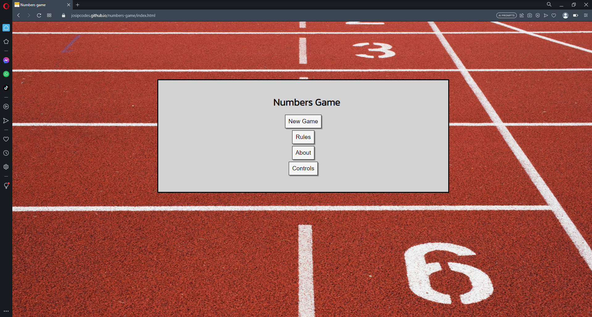
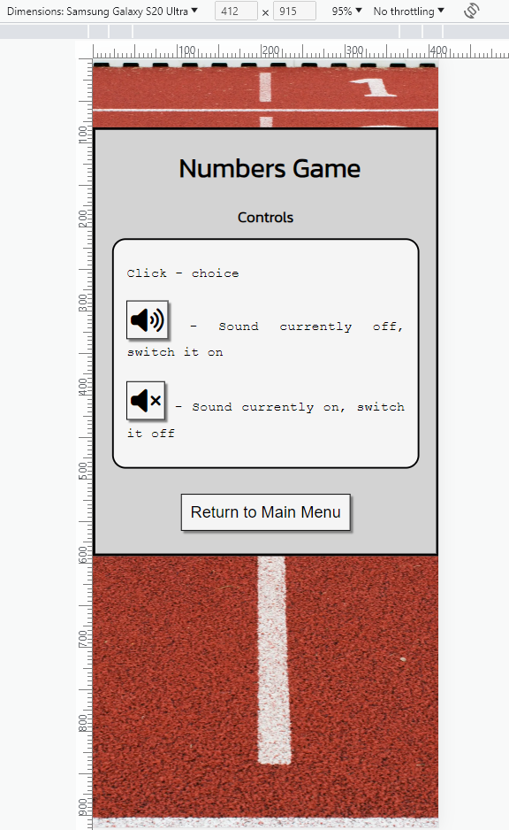
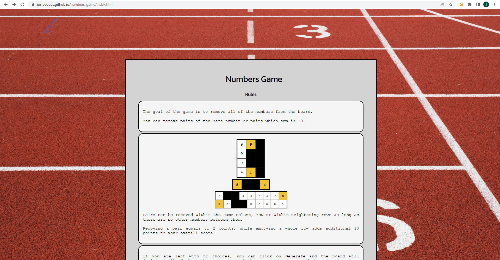

# Testing

Return back to the [README.md](README.md) file.

## Code Validation

### HTML

I have used the recommended [HTML W3C Validator](https://validator.w3.org) to validate all of my HTML files.

| Page | W3C URL | Screenshot | Notes |
| --- | --- | --- | --- |
| Index | [W3C](https://validator.w3.org/nu/?doc=https%3A%2F%2Fjosipcodes.github.io%2Fnumbers-game%2Findex.html) |  | Pass: no warnings |
| 404 | [W3C](https://validator.w3.org/nu/?doc=https%3A%2F%2Fjosipcodes.github.io%2Fnumbers-game%2F404.html) |  | Pass: no warnings |

### CSS

I have used the recommended [CSS Jigsaw Validator](https://jigsaw.w3.org/css-validator) to validate all of my CSS files.

| File | Jigsaw URL | Screenshot | Notes |
| --- | --- | --- | --- |
| style.css | [Jigsaw](https://jigsaw.w3.org/css-validator/validator?uri=https%3A%2F%2Fjosipcodes.github.io%2Fnumbers-game) |  | Pass: No Errors |

### JavaScript

I have used the recommended [JShint Validator](https://jshint.com) to validate all of my JS files.

| File | Screenshot | Notes |
| --- | --- | --- |
| script.js |  | Pass: no errors |

## Browser Compatibility

I've tested my deployed project on multiple browsers to check for compatibility issues.

| Browser | Menu screenshot | Game screenshot | 404 screenshot | Notes |
| --- | --- | --- | --- | --- |
| Chrome |  |  |  | Works as expected |
| Firefox |  |  |  | Works as expected |
| Edge |  |  |  | Works as expected |
| Brave |  |  |  | Works as expected |
| Opera |  |  |  | Works as expected |

## Responsiveness

I've tested my deployed project on multiple devices to check for responsiveness issues.

| Device | Main Menu Screenshot | Rules Screenshot | Controls Screenshot | Generate-warning Screenshot | Hint Screenshot | 404 Screenshot | Notes |
| --- | --- | --- | --- | --- | --- | --- | --- |
| Samsung Galaxy S20 Ultra (DevTools) |  |  |  |  |  |  | Works as expected |
| Surface Pro 7 (DevTools) |  |  |  |  |  |  | Works as expected |
| Desktop |  |  |  |  |  |  | Works as expected |

## Lighthouse Audit

I've tested my deployed project using the Lighthouse Audit tool to check for any major issues.

| Page | Size | Screenshot | Notes |
| --- | --- | --- | --- |
| Home | Mobile |  | Some minor warnings |
| Home | Desktop |  | Few warnings |
| 404 | Mobile |  | Some minor warnings |
| 404 | Desktop |  | Few warnings |

## Defensive Programming

Defensive programming was manually tested with the below user acceptance testing:

| Page/section | User Action | Expected Result | Pass/Fail | Comments |
| --- | --- | --- | --- | --- |
| Home Page/Main Menu | | | | |
| | Click on New Game | Redirection to difficulty section | Pass | |
| | Click on Rules | Redirection to rules section | Pass | |
| | Click on About | Redirection to about section | Pass | |
| | Click on Controls | Redirection to controls section | Pass | |
| | Click on Continue Game | Redirection to the game | Pass | |
| | Click on Quit Game | Pop-up with confirmation request generating | Pass | |
| | Press C | Redirection to the game | Pass | |
| | Confirm quitting the game in pop-up | Closes pop-up, removes continue and quit game buttons from the Main menu | Pass | |
| | Decline quitting the game in pop-up | Closes pop-up | Pass | |
| Home Page/Rules | | | | |
| | Click on Return to Main Menu | Redirection to the Main Menu | Pass | |
| Home Page/About | | | | |
| | Click on the link | Opens Numbers Game Github README in a new tab | Pass | |
| | Click on Return to Main Menu | Redirection to the Main Menu | Pass | |
| Home Page/Controls | | | | |
| | Click on Return to Main Menu | Redirection to the Main Menu | Pass | |
| Home Page/Difficulty section | | | | |
| | Click on Beginner | Redirection to the game, with beginner mode launched | Pass | |
| | Click on Intermediate | Redirection to the game, with intermediate mode launched | Pass | |
| | Click on Expert | Redirection to the game, with expert mode launched | Pass | |
| | Click on Return to Main Menu | Redirection to the Main Menu | Pass | |
| Home Page/Game Section | | | | |
| | Click on Generate | Generates spans with numbers which were currently present on the board | Pass | |
| | Click on Undo | Removes the previous move, updates score | Pass | |
| | Click on Hint | Highlights the first available hint, updates score | Pass | |
| | Click on Remove Fifth | Removes 1/5 of spans, updates score | Pass | |
| | Click on Sound On | Switches sound on | Pass | |
| | Click on Sound Off | Switches sound off | Pass | |
| | Press M | Toggles sound | Pass | |
| | Press H | Highlights the first available hint, updates score | Pass | |
| | Press G | Generates spans with numbers which were currently present on the board | Pass | |
| | Press F | Removes 1/5 of spans, updates score | Pass | |
| | Press P | Redirection to the Main Menu, enables continue game and quit game buttons | Pass | |
| | Click on Return to Main Menu | Redirection to the Main Menu, enables continue game and quit game buttons | Pass | |
| | Click OK on pop-up confirming game has been won | Redirection to the Main Menu, hides continue game and quit game buttons | Pass | |
| General | | | | |
| | Enter invalid URL | Redirection to the 404 page | Pass | |
| 404 | | | | |
| | Click on the link | Redirection to the Home page | Pass | |

## Bugs

**Fixed Bugs**

- Last row of spans doesn't follow the height of remaining rows if empty.

    

    - To fix this, I have included a min-height CSS rule depending on the screen-width.

- Uncaught TypeError: Cannot read properties of undefined (reading 'innerHTML').

    

    - As the error came from for loop working from 0 to the last position, all while it removes every 5th span, eventually for loop would not have anything in the index which was previously manifested. To fix this, I have set the for loop to start from the array end and work back to the position 0. 

    

- Provided hint remains stuck if the hint starts in the first row and is vertical. Pressing hint button again would not move the hint further.

    

    - Cause of the issue comes from addLocation() as it sets a location to a string. This resulted in j being itterated as 0-1-2-3-4-5-6-7-8-9-01 (0+'1'). To fix this I have implemented a break in such instances. I admit that this was a quick and not-ideal fix as it caused a minor issue down the line noted in open bugs.

    
    

- In-game keyboard shortcuts work when the game is paused.

    - This was caused by an error in the first if statement where equality was not set properly (assignment instead of equality). To fix this, I have set the condition to strict equality.

    

- When the game is won, 2 pop-ups appear; first one notifies user of the win, second one asks to confirm if they want to quit the game.

    - This was caused by isGameWonCheck() function triggering quitGameConfirm() which generates a pop-up. To fix this, I have separated the process of quitting the game into two separate functions - one which asks for confirmation and another one which actually performs the action. As a result, isGameWonCheck() now triggers quitGameAction().

    
    

## Unfixed Bugs

- On devices smaller than 375px, the page starts to have `overflow-x` scrolling.

    
    

    - Attempted fix: I tried to add additional media queries to handle this, but the content started becoming too small to read.

---
- provideHint() misses hints in instances where there is a vertical and horizontal hint to be provided, starting with the same span. This would only be noticed by the user if they opted to use the hint option repeatedly without actually removing the provided hint off the board.

    

    - Attempted fix: This is a result of a previous fix documented in fixed bugs section where provideHint would remain stuck on a single hint. I tried changing the logic of addLocation() unsuccessfully as well as changing the logic of the provideHint(), however, this would create more bugs which, unlike the current one, impact the user experience. 

---
- abusing generate button can result in overall slowness if a significant amount of span exists on the screen. 

    

    - Attempted fix: Temporary buffer was built by opening a dialog after 4 consecutive uses of the generate button but the underlaying issue remains. Permanent fix would require a complete overhaul of the game's logic.

## What could have been done better

**Acknowledgment of the process flaws**
    
- Some of the initial commit messages start with a lowercase character. I have since been made aware of this not being ideal and although the explicit rule was not found in Code Institute's guidelines, I admit a personal error.

- checkLocation and provideHint functions are too lenghty for personal liking. I have stried to keep all of the functions short, however, due to the complexity of the task attributed to the two functions, I felt more comfortable keeping them lenghty as opposed to breaking them up in multiple short functions. I can see some of the issues I've since come accross being a result of this. 

