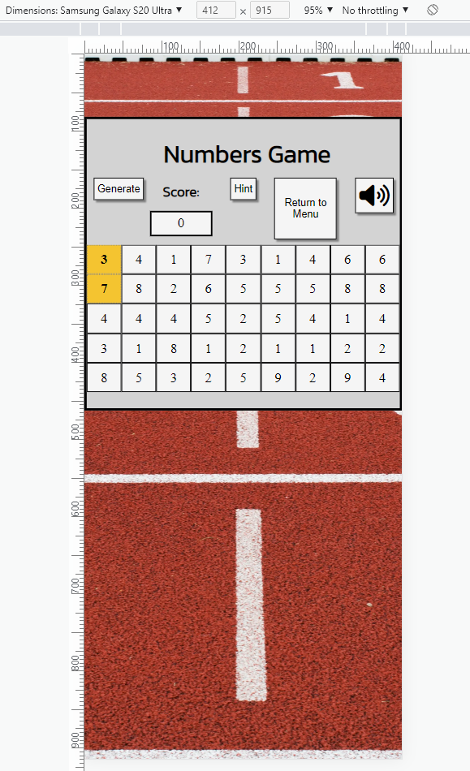

# Testing

Return back to the [README.md](README.md) file.

## Code Validation

⚠️⚠️⚠️⚠️⚠️ START OF NOTES (to be deleted) ⚠️⚠️⚠️⚠️⚠️

**IMPORTANT**: You must provide a screenshot for each file you validate.

**PRO TIP**: Always validate the live site pages, not your local code. There could be subtle/hidden differences.

🛑🛑🛑🛑🛑 END OF NOTES (to be deleted) 🛑🛑🛑🛑🛑

### HTML

I have used the recommended [HTML W3C Validator](https://validator.w3.org) to validate all of my HTML files.

| Page | W3C URL | Screenshot | Notes |
| --- | --- | --- | --- |
| Index | [W3C](https://validator.w3.org/nu/?doc=https%3A%2F%2Fjosipcodes.github.io%2Fnumbers-game%2Findex.html) |  | Pass: no warnings |
| 404 | [W3C](https://validator.w3.org/nu/?doc=https%3A%2F%2Fjosipcodes.github.io%2Fnumbers-game%2F404.html) |  | Pass: no warnings |

### CSS

I have used the recommended [CSS Jigsaw Validator](https://jigsaw.w3.org/css-validator) to validate all of my CSS files.

| File | Jigsaw URL | Screenshot | Notes |
| --- | --- | --- | --- |
| style.css | [Jigsaw](https://jigsaw.w3.org/css-validator/validator?uri=https%3A%2F%2Fjosipcodes.github.io%2Fnumbers-game) |  | Pass: No Errors |

### JavaScript

I have used the recommended [JShint Validator](https://jshint.com) to validate all of my JS files.

| File | Screenshot | Notes |
| --- | --- | --- |
| script.js |  | Pass: no errors |

## Browser Compatibility

I've tested my deployed project on multiple browsers to check for compatibility issues.

| Browser | Menu screenshot | Game screenshot | 404 screenshot | Notes |
| --- | --- | --- | --- | --- |
| Chrome |  |  |  | Works as expected |
| Firefox |  |  |  | Works as expected |
| Edge |  |  |  | Works as expected |
| Brave |  |  |  | Works as expected |
| Opera |  |  |  | Works as expected |

## Responsiveness

I've tested my deployed project on multiple devices to check for responsiveness issues.

| Device | Main Menu Screenshot | Rules Screenshot | Controls Screenshot | Generate-warning Screenshot | Hint Screenshot | 404 Screenshot | Notes |
| --- | --- | --- | --- | --- | --- | --- | --- |
| Samsung Galaxy S20 Ultra (DevTools) |  |  |  |  |  |  | Works as expected |
| Surface Pro 7 (DevTools) |  |  |  |  |  |  | Works as expected |
| Desktop |  |  |  |  |  |  | Works as expected |

## Lighthouse Audit

I've tested my deployed project using the Lighthouse Audit tool to check for any major issues.

| Page | Size | Screenshot | Notes |
| --- | --- | --- | --- |
| Home | Mobile |  | Some minor warnings |
| Home | Desktop |  | Few warnings |
| 404 | Mobile |  | Some minor warnings |
| 404 | Desktop |  | Few warnings |

## Defensive Programming

Defensive programming was manually tested with the below user acceptance testing:

| Page/section | User Action | Expected Result | Pass/Fail | Comments |
| --- | --- | --- | --- | --- |
| Home Page/Main Menu | | | | |
| | Click on New Game | Redirection to difficulty section | Pass | |
| | Click on Rules | Redirection to rules section | Pass | |
| | Click on About | Redirection to about section | Pass | |
| | Click on Controls | Redirection to controls section | Pass | |
| | Click on Continue Game | Redirection to the game | Pass | |
| | Click on Quit Game | Pop-up with confirmation request generating | Pass | |
| | Press C | Redirection to the game | Pass | |
| | Confirm quitting the game in pop-up | Closes pop-up, removes continue and quit game buttons from the Main menu | Pass | |
| | Decline quitting the game in pop-up | Closes pop-up | Pass | |
| Home Page/Rules | | | | |
| | Click on Return to Main Menu | Redirection to the Main Menu | Pass | |
| Home Page/About | | | | |
| | Click on the link | Opens Numbers Game Github README in a new tab | Pass | |
| | Click on Return to Main Menu | Redirection to the Main Menu | Pass | |
| Home Page/Controls | | | | |
| | Click on Return to Main Menu | Redirection to the Main Menu | Pass | |
| Home Page/Difficulty section | | | | |
| | Click on Beginner | Redirection to the game, with beginner mode launched | Pass | |
| | Click on Intermediate | Redirection to the game, with intermediate mode launched | Pass | |
| | Click on Expert | Redirection to the game, with expert mode launched | Pass | |
| | Click on Return to Main Menu | Redirection to the Main Menu | Pass | |
| Home Page/Game Section | | | | |
| | Click on Generate | Generates spans with numbers which were currently present on the board | Pass | |
| | Click on Undo | Removes the previous move, updates score | Pass | |
| | Click on Hint | Highlights the first available hint, updates score | Pass | |
| | Click on Remove Fifth | Removes 1/5 of spans, updates score | Pass | |
| | Click on Sound On | Switches sound on | Pass | |
| | Click on Sound Off | Switches sound off | Pass | |
| | Press M | Toggles sound | Pass | |
| | Press H | Highlights the first available hint, updates score | Pass | |
| | Press G | Generates spans with numbers which were currently present on the board | Pass | |
| | Press F | Removes 1/5 of spans, updates score | Pass | |
| | Press P | Redirection to the Main Menu, enables continue game and quit game buttons | Pass | |
| | Click on Return to Main Menu | Redirection to the Main Menu, enables continue game and quit game buttons | Pass | |
| | Click OK on pop-up confirming game has been won | Redirection to the Main Menu, hides continue game and quit game buttons | Pass | |
| General | | | | |
| | Enter invalid URL | Redirection to the 404 page | Pass | |
| 404 | | | | |
| | Click on the link | Redirection to the Home page | Pass | |

## Bugs

⚠️⚠️⚠️⚠️⚠️ START OF NOTES (to be deleted) ⚠️⚠️⚠️⚠️⚠️

It's very important to document any bugs you've discovered while developing the project.
Make sure to include any necessary steps you've implemented to fix the bug(s) as well.

For JavaScript and Python applications, it's best to screenshot the errors to include them as well.

**PRO TIP**: screenshots of bugs are extremely helpful, and go a long way!

🛑🛑🛑🛑🛑 END OF NOTES (to be deleted) 🛑🛑🛑🛑🛑

- JS Uncaught ReferenceError: `foobar` is undefined/not defined

    

    - To fix this, I _____________________.

- JS `'let'` or `'const'` or `'template literal syntax'` or `'arrow function syntax (=>)'` is available in ES6 (use `'esversion: 11'`) or Mozilla JS extensions (use moz).

    

    - To fix this, I _____________________.

- Python `'ModuleNotFoundError'` when trying to import module from imported package

    

    - To fix this, I _____________________.

- Django `TemplateDoesNotExist` at /appname/path appname/template_name.html

    

    - To fix this, I _____________________.

- Python `E501 line too long` (93 > 79 characters)

    

    - To fix this, I _____________________.

### GitHub **Issues**

⚠️⚠️⚠️⚠️⚠️ START OF NOTES (to be deleted) ⚠️⚠️⚠️⚠️⚠️

An improved way to manage bugs is to use the built-in **Issues** tracker on your GitHub repository.
To access your Issues, click on the "Issues" tab at the top of your repository.
Alternatively, use this link: https://github.com/josipcodes/numbers-game/issues

If using the Issues tracker for your bug management, you can simplify the documentation process.
Issues allow you to directly paste screenshots into the issue without having to first save the screenshot locally,
then uploading into your project.

You can add labels to your issues (`bug`), assign yourself as the owner, and add comments/updates as you progress with fixing the issue(s).

Once you've sorted the issue, you should then "Close" it.

When showcasing your bug tracking for assessment, you can use the following format:

🛑🛑🛑🛑🛑 END OF NOTES (to be deleted) 🛑🛑🛑🛑🛑

**Fixed Bugs**

All previously closed/fixed bugs can be tracked [here](https://github.com/josipcodes/numbers-game/issues?q=is%3Aissue+is%3Aclosed).

| Bug | Status |
| --- | --- |
| [JS Uncaught ReferenceError: `foobar` is undefined/not defined](https://github.com/josipcodes/numbers-game/issues/1) | Closed |
| [Python `'ModuleNotFoundError'` when trying to import module from imported package](https://github.com/josipcodes/numbers-game/issues/2) | Closed |
| [Django `TemplateDoesNotExist` at /appname/path appname/template_name.html](https://github.com/josipcodes/numbers-game/issues/3) | Closed |

**Open Issues**

Any remaining open issues can be tracked [here](https://github.com/josipcodes/numbers-game/issues).

| Bug | Status |
| --- | --- |
| [JS `'let'` or `'const'` or `'template literal syntax'` or `'arrow function syntax (=>)'` is available in ES6 (use `'esversion: 11'`) or Mozilla JS extensions (use moz).](https://github.com/josipcodes/numbers-game/issues/4) | Open |
| [Python `E501 line too long` (93 > 79 characters)](https://github.com/josipcodes/numbers-game/issues/5) | Open |

## Unfixed Bugs

⚠️⚠️⚠️⚠️⚠️ START OF NOTES (to be deleted) ⚠️⚠️⚠️⚠️⚠️

You will need to mention unfixed bugs and why they were not fixed.
This section should include shortcomings of the frameworks or technologies used.
Although time can be a big variable to consider, paucity of time and difficulty understanding
implementation is not a valid reason to leave bugs unfixed.

If you've identified any unfixed bugs, no matter how small, be sure to list them here.
It's better to be honest and list them, because if it's not documented and an assessor finds the issue,
they need to know whether or not you're aware of them as well, and why you've not corrected/fixed them.

Some examples:

🛑🛑🛑🛑🛑 END OF NOTES (to be deleted) 🛑🛑🛑🛑🛑

- On devices smaller than 375px, the page starts to have `overflow-x` scrolling.

    

    - Attempted fix: I tried to add additional media queries to handle this, but things started becoming too small to read.

- For PP3, when using a helper `clear()` function, any text above the height of the terminal does not clear, and remains when you scroll up.

    

    - Attempted fix: I tried to adjust the terminal size, but it only resizes the actual terminal, not the allowable area for text.

- When validating HTML with a semantic `section` element, the validator warns about lacking a header `h2-h6`. This is acceptable.

    

    - Attempted fix: this is a known warning and acceptable, and my section doesn't require a header since it's dynamically added via JS.

⚠️⚠️⚠️⚠️⚠️ START OF NOTES (to be deleted) ⚠️⚠️⚠️⚠️⚠️

If you legitimately cannot find any unfixed bugs or warnings, then use the following sentence:

🛑🛑🛑🛑🛑 END OF NOTES (to be deleted) 🛑🛑🛑🛑🛑

There are no remaining bugs that I am aware of.
